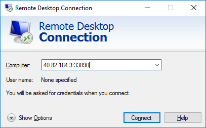

# GC Cloud Accelerator Demo Infrastructure Deployment

This HOWTO will guide you to deploy a DEMO Infrastructure comprised of multiple modules.

## Prerequisite

You need to have deployed a functional Development VM as per the [Deploy Development VM](../DeployDevelopmentVM) HOWTO.

## Demo Infrastructure Deployment
### 1. Core Infrastructure

On GC Cloud Accelerator Development VM go in the demov3\msfirewall\demo-core-msfw-nsg folder.

Login to your Azure subscription with:

```powershell
cd <path to demov3\msfirewall\demo-core-msfw-nsg>
login-azurermaccount
```

Select the desired subscription (if you have more than one) with:

```powershell
get-azurermsubscription
select-azurermsubscription <name>
```

Deploy the core infrastructure with:

```powershell
.\masterdeploy.ps1
```

If all goes well this will take about 12 minutes.

### 2. Demo Web Server

When the infrastructure is deployed it is now time to add the desired subsequent modules. Do you want to 1st test a sample website in your demo infrastructure? Go in the demov3\msfirewall\demo-docker-web and deploy it with:

```powershell
cd ..\demo-docker-web
.\masterdeploy.ps1
```

This will take about 5 minutes. Once deployed you will obtain the URL that you can use to connect and view the demo page. It should look like:

```text
There was no deployment errors detected. All look good.

Connect to the demo website using a web browser at http://40.82.184.3
Connect to the docker server using SSH to 40.82.184.3
```

Connecting to the URL should give you:


### 3. Temporary Jumpbox

Now that you know the base infrastructure is working as expected by validating access to the demo web server you can now add the temporary jumpbox modules. Go in the demov3\msfirewall\demo-temporary-jumpbox and deploy it with:

```powershell
cd ..\demo-temporary-jumpbox
.\masterdeploy.ps1
```

This will take about 7 minutes. Once deployed you will obtain the IP and TCP port you can use to connect to the temporary jumpbox. It should look like:

```text
There was no deployment errors detected. All look good.

Connect to the temporary jumpbox at 40.82.184.3:33890
```

Simply connect to it using an RDP client:



and authenticate using the default demo credentials:

```text
Username: azureadmin
Password: Canada123!
```

You will need to use this jumpbox at a future stage to configure the "final" Remode Desktop Service" farm that will be deployed later.

### 4. Management Active Directory Domain Servers

Time to get down to business. Let's deploy our demo management Active Directory servers. DOn't worry. it is as easy as what you have done so far. Go in the demov3\msfirewall\mgmt-ADDS and deploy it with:

```powershell
cd ..\mgmt-ADDS
.\masterdeploy.ps1
```

This will take about 50 minutes is the wind is blowing on your back... longer if you hit a bad Azure day ;-).

Once deployed you will obtain the following message:

```text
There was no deployment errors detected. All look good.
```

At this point you can connect to the ADDS servers by starting an RDP session from the Jumpbox deployed at step 3. The IP address of the demo ADDS servers are:

```text
DemoMGMTDC01: 10.25.8.20
DemoMGMTDC02: 10.25.8.21
```

Authenticate using the default demo credentials:

```text
Username: mgmt\azureadmin
Password: Canada123!
```

You will also need to update the dhcp options in the management vnet to allow servers in that vnet to use the ADDS servers for name resolution. This is required to be able to join the domain in the vnet later on. This can ve accomplished by editing subnet-vnet parameters file of the mamagement vnet to add the following dhcp option to and redeploy it to Azure:

```
    "dhcpOptions":  {
        "dnsServers": [
            "10.25.8.20",
            "10.25.8.21"
        ]
    },
```

An already a modified parameters file in the demo-core-msfw-nsg\parameters folder called deploy-20-vnet-subnet-mgmt-postadds.parameters.json is provided as part of this demo... so no need to edit any file unless you insist on doing so ;-)

At this point you need to re-deploy the management vnet using the modified parameter file with:

```
    cd ..\demo-core-msfw-nsg
    .\masterdeploy-post-adds.ps1
```

### 5. Management Remote Desktop Services

Let's deploy our demo RDS servers that will allow easy user access over https to the servers in the infrastructure. This is also a one script deploy. Go in the demov3\msfirewall\mgmt-RDS and deploy it with:

```powershell
cd ..\mgmt-RDS
.\masterdeploy.ps1
```

This will take about 30 minutes hopefully.

Once deployed you will obtain the following message:

```text
There was no deployment errors detected. All look good.
```

At this point you need to connect to the gateway RDS servers by starting an RDP session from the Jumpbox deployed at step 3. The IP address of the demo gateway RDS servers is:

```text
DEMORDSGW: 10.25.4.4
```

Authenticate using the default demo credentials:

```text
Username: mgmt\azureadmin
Password: Canada123!
```

Once connected to it use the Server Manager applications that will open on the desktop to manage the gateway server. Here is a short HOWTO Video that will explain what to do to configure a temporary self-signed certificate on the server:

**This is not working yet. Need to figure out issue with FQDN used to authenticate. Will probably require some rewrite of this deployment as a fix**

* Click Remote Desktop Services

* Click Servers

* Right-click on gateway name in Servers section

* Select RD Gateway Managet option

* Right-click on gateway.mgmt.demo.gc.ca.local (Remote)

* Select Properties

* Click on SSL Certificates

* Click Create a self-signed certificate

* Click Create and Import Certificate...

* Click OK

* Click OK

* Click OK

* Copy certificate from Documents and import it on the PC that will need to connect to the Demo RDS service. For example your GC Cloud Accelerator Dev VM.

* Install the certificate in Local Machine/Trusted Root Certification Authorities

* Connect to https://\<dns name of msfirewall pubip\>/rdweb
    
* Accept warning
    
* Authenticate using the default demo credentials:

```text
Username: mgmt\azureadmin
Password: Canada123!
```

* Click the Desktop Collection icon

* Click on the downloaded file

* Click Connect

* Authenticate using the default demo credentials:

```text
Username: mgmt\azureadmin
Password: Canada123!
```


-- Add video here --
